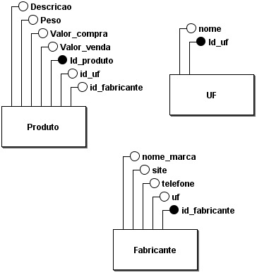

# Projeto 3 (Lista Avaliativa 3)

## Índice 

- [Projeto 3 (Lista Avaliativa 3)](#Projeto 3 (Lista Avaliativa 3))
- [Índice](#índice)
- [Descrição do projeto](#descrição-do-projeto)
- [:hammer: Funcionalidades do projeto](#hammer-funcionalidades-do-projeto)
- [📁 Acesso ao projeto](#-acesso-ao-projeto)
- [✔️ Técnicas e tecnologias utilizadas](#️-técnicas-e-tecnologias-utilizadas)
- [Autores](#autores)

## Descrição do projeto
O Projeto 3 (Lista Avaliativa 3) tem o objetivo de aprendizado ao GIT e todos o conteudos passados em sala de aula.

## :hammer: Funcionalidades do projeto

- `Funcionalidade 1`: Criacao de um menu.
- `Funcionalidade 2`: Entrada e saida de dados.
- `Funcionalidade 2a`: Contas simples (Multiplicacao, soma e porcentagem.)
- `Funcionalidade 3`: Apresentacao dos resultadados.

## 📁 Acesso ao projeto
Você pode acessar os arquivos do projeto clicando [aqui](https://github.com/Pedro-Chaves2505/lista3-APE).

## ✔️ Técnicas e tecnologias utilizadas

- ``C``

## Autores

| [ Jeferson Lopes Reis](https://github.com/jef-loppes-reis) | [ Pedro Chaves](https://github.com/Pedro-Chaves2505) |
| :---: | :---: |
