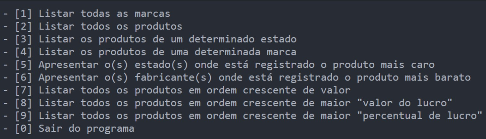
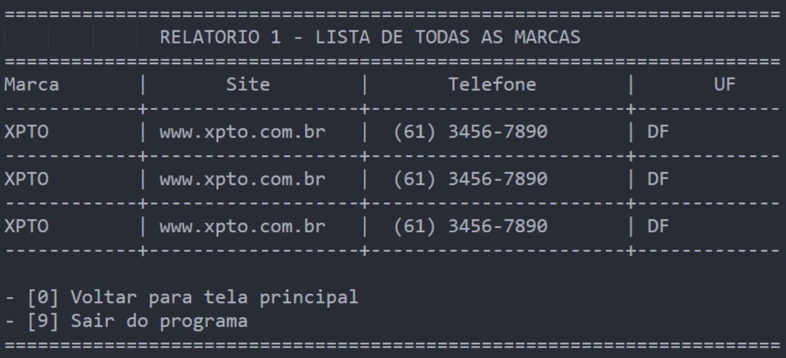

# Projeto 3 (Lista Avaliativa 3)

## Índice 

- [Projeto 3 (Lista Avaliativa 3)](#projeto-3-lista-avaliativa-3)
- [Índice](#índice)
- [Descrição do projeto](#descrição-do-projeto)
- [Funcionalidades do projeto](#hammer-funcionalidades-do-projeto)
- [Acesso ao projeto](#-acesso-ao-projeto)
- [Técnicas e tecnologias utilizadas](#️-técnicas-e-tecnologias-utilizadas)
- [Autores](#autores)

## Descrição do projeto

  <h4>
    O Projeto 3 (Lista Avaliativa 3) tem o objetivo de aprendizado ao GIT e todos o conteudos passados em sala de aula.
    

      Elabore um programa onde o usuário armazenará por meio de Structs os dados de "Produtos"
      e "Fabricantes", serão cadastrados no mínimo 2 fabricantes (máximo 5) e no mínimo 5 produtos
      (máximo 50).
    

    

      Produto: Descrição, peso, valor de compra, valor de venda, valor do lucro (calculado
      automaticamente), percentual do lucro (calculado automaticamente) e fabricante.
      Fabricante: Marca (nome), site, telefone, UF (todas as unidades da federação previamente
      cadastradas AC, AM, AP,.., SP, TO).
    

      Por fim crie um menu para emitir os relatórios abaixo:
  </h4>

  <h4>
    

      - Utilizem o máximo de funções e procedimentos no estilo "le_valida" para minimizar os erros de cadastros por parte dos usuários.
    

    

      Façam bom uso de "tabelas" para apresentação das telas como no exemplo abaixo:
    

  </h4>

## :hammer: Funcionalidades do projeto

- `Funcionalidade 1`: Entradas e Saídas dos dados.
- `Funcionalidade 2`: Apresentação do menu.
- `Funcionalidade 2a`: Contas simples (Multiplicação, soma e porcentagem.)
- `Funcionalidade 3`: Apresentação das informações.

## 📁 Acesso ao projeto
Você pode acessar os arquivos do projeto clicando [aqui](https://github.com/Pedro-Chaves2505/lista3-APE).

## ✔️ Técnicas e tecnologias utilizadas

## Autores

| [ Jeferson Lopes Reis](https://github.com/jef-loppes-reis) | [ Pedro Chaves](https://github.com/Pedro-Chaves2505) | [ Kennedy Torres](https://github.com/Kennedy-Torres) | [ Davi](https://github.com/villehauk) | 
| :---: | :---: | :---: | :---: |
